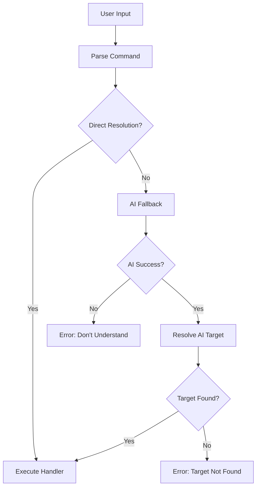

# Command Parsing Philosophy

**Created**: 2025-08-22  
**Status**: Design Guideline  
**Audience**: Developers working on Shadow Kingdom command system  

## Core Philosophy

The **Command Parser** is responsible for **object disambiguation and target resolution**. Individual command handlers should focus purely on **action execution** and assume their targets have already been identified and validated.

## Architecture Principles

### 1. **Separation of Concerns**

```
User Input → Command Parser → Action Handler → Game State Change
            ↓                 ↓
         Target Resolution   Action Execution
```

- **Command Parser**: "What does the user want to do, and to what?"
- **Action Handler**: "Now that I know the target, how do I perform this action?"

### 2. **Parser Responsibility Hierarchy**

```
1. Direct Entity Resolution    (fast path)
2. Contextual Disambiguation   (smart matching)
3. AI Fallback Resolution      (natural language)
4. Action Handler Execution    (clean interface)
```

## Implementation Strategy

### Current State: Anti-Pattern ❌

```typescript
// WRONG: Handler does its own target finding
async handleExamine(args: string[]) {
  const targetName = stripArticles(args.join(' '));
  const target = await this.examineService.findExaminableTarget(
    roomId, gameId, characterId, targetName
  );
  
  if (!target) {
    this.tui.display("Target not found");
    return;
  }
  
  // Finally do the actual action...
}
```

**Problems:**
- Every handler duplicates target resolution logic
- Inconsistent error messages across commands
- No centralized disambiguation strategy
- AI fallback logic scattered throughout handlers

### Target State: Correct Pattern ✅

```typescript
// CORRECT: Parser handles target resolution
class CommandParser {
  async processCommand(input: string, context: GameContext): Promise<void> {
    const { verb, rawTarget } = this.parseCommand(input);
    
    // 1. Try direct entity resolution
    const target = await this.resolveTarget(rawTarget, context);
    
    if (target) {
      // Call handler with resolved target
      await this.executeHandler(verb, target, context);
      return;
    }
    
    // 2. Fall back to AI for disambiguation
    const aiResult = await this.nlpEngine.processCommand(input, context);
    if (aiResult) {
      const resolvedTarget = await this.resolveTarget(aiResult.target, context);
      await this.executeHandler(aiResult.verb, resolvedTarget, context);
      return;
    }
    
    // 3. True failure
    this.displayError(`I don't understand "${input}"`);
  }
}

// CLEAN: Handler focuses on action only
async handleExamine(target: ResolvedTarget, context: GameContext) {
  const description = this.examineService.getExaminationText(target);
  this.tui.display(description, MessageType.NORMAL);
  // No target resolution logic!
}
```

## Target Resolution Strategy

### Entity Resolution Hierarchy

```typescript
interface TargetResolver {
  async resolveTarget(input: string, context: GameContext): Promise<ResolvedTarget | null> {
    // 1. EXACT MATCHES (fastest)
    let target = await this.findExactMatch(input, context);
    if (target) return target;
    
    // 2. PARTIAL MATCHES (smart)
    target = await this.findPartialMatch(input, context);
    if (target) return target;
    
    // 3. CONTEXTUAL MATCHES (intelligent)
    target = await this.findContextualMatch(input, context);
    if (target) return target;
    
    // 4. Return null → triggers AI fallback
    return null;
  }
}
```

### Search Priority Order

1. **Characters in room** (NPCs, enemies, players)
2. **Items in inventory** (what player carries)
3. **Items in room** (what player can see/interact with)
4. **Room features** (exits, furniture, fixtures)
5. **Environmental objects** (AI-described elements)

### Disambiguation Examples

```typescript
// INPUT: "look at the ancient sword"
// PARSING: verb="look", target="ancient sword"
// RESOLUTION: 
//   1. Strip articles: "ancient sword"
//   2. Search inventory: InventoryItem{ name: "Ancient Elven Sword" } ✓
//   3. Return ResolvedTarget{ type: "inventory_item", entity: sword }

// INPUT: "examine the mysterious pedestal"  
// PARSING: verb="examine", target="mysterious pedestal"
// RESOLUTION:
//   1. Strip articles: "mysterious pedestal"
//   2. Search entities: null
//   3. AI Fallback: "The ornate stone pedestal bears ancient runes..."

// INPUT: "attack the guardian"
// PARSING: verb="attack", target="guardian"  
// RESOLUTION:
//   1. Strip articles: "guardian"
//   2. Search characters: Character{ name: "Ancient Guardian" } ✓
//   3. Return ResolvedTarget{ type: "character", entity: guardian }
```

## Command Handler Interface

### Standardized Handler Signature

```typescript
interface CommandHandler {
  // BEFORE: Handlers took raw strings
  async execute(args: string[], context: GameContext): Promise<void>;
  
  // AFTER: Handlers take resolved targets
  async execute(target: ResolvedTarget, context: GameContext): Promise<ActionResult>;
}

interface ResolvedTarget {
  type: 'character' | 'inventory_item' | 'room_item' | 'room_feature' | 'environmental';
  entity: Character | InventoryItem | RoomItem | RoomFeature | EnvironmentalObject;
  name: string;         // Canonical name for display
}

interface ActionResult {
  success: boolean;
  message?: string;
  sideEffects?: GameStateChange[];
}
```

### Handler Simplification Benefits

```typescript
// EXAMINE HANDLER - Before vs After

// BEFORE: 40 lines of target resolution + 5 lines of action
async handleExamine(args: string[]) {
  if (!this.gameStateManager.isInGame()) return;
  const targetName = stripArticles(args.join(' '));
  if (!targetName) { /* error handling */ }
  const target = await this.examineService.findExaminableTarget(/*...*/);
  if (!target) { /* fallback logic */ }
  
  // Finally, the actual action:
  const text = this.examineService.getExaminationText(target);
  this.tui.display(text, MessageType.NORMAL);
}

// AFTER: 3 lines total, pure action logic
async handleExamine(target: ResolvedTarget, context: GameContext): Promise<ActionResult> {
  const text = this.examineService.getExaminationText(target.entity);
  context.ui.display(text, MessageType.NORMAL);
  return { success: true };
}
```

## AI Fallback Integration

### Natural Language → Structured Commands

```typescript
interface AICommandResult {
  verb: string;           // "examine", "attack", "take"
  target: string;         // "pedestal", "rusty key", "north exit"  
  context?: string;       // Additional context for disambiguation
}

// Example AI processing:
// INPUT: "look at the glowing thing on the altar"
// AI OUTPUT: { 
//   verb: "examine", 
//   target: "glowing orb",
//   context: "magical artifact on stone altar"
// }
```

### Fallback Flow



## Migration Strategy

### Phase 1: Extract Target Resolution (Current)

```typescript
// Keep existing handlers but extract resolution logic
private async handleExamine(args: string[]): Promise<boolean> {
  const target = await this.resolveExamineTarget(args);
  if (!target) return false; // Trigger AI fallback
  
  // Pure action logic
  const text = this.examineService.getExaminationText(target);
  this.tui.display(text, MessageType.NORMAL);
  return true;
}
```

### Phase 2: Centralize Resolution

```typescript
// Move resolution into CommandRouter
class CommandRouter {
  async processCommand(input: string, context: GameContext): Promise<void> {
    const parsed = this.parseInput(input);
    const target = await this.globalTargetResolver.resolve(parsed.target, context);
    
    if (target) {
      await this.executeHandler(parsed.verb, target, context);
    } else {
      await this.handleAIFallback(input, context);
    }
  }
}
```

### Phase 3: Standardize Handlers

```typescript
// Convert all handlers to new interface
interface StandardCommandHandler {
  async execute(target: ResolvedTarget, context: GameContext): Promise<ActionResult>;
}
```

## Benefits of This Approach

### 1. **Consistency**
- Unified target resolution across all commands
- Consistent error messages and disambiguation
- Predictable AI fallback behavior

### 2. **Maintainability**
- Target resolution logic in one place
- Handlers focus on single responsibility
- Easy to add new entity types globally

### 3. **Extensibility**
- New commands automatically get smart target resolution
- AI fallback works for any command structure  
- Easy to add new disambiguation strategies

### 4. **User Experience**
- Predictable command interpretation
- Smart partial matching across all commands
- Graceful fallback to natural language

### 5. **Performance**
- Optimized search order (fast common cases first)
- Cached entity lookups
- Minimal redundant database queries

## Example Command Flows

### Simple Success Path
```
User: "examine sword"
Parser: verb="examine", target="sword" 
Resolver: Found InventoryItem("Iron Sword")
Handler: Display examination text
Result: "A well-crafted iron blade..."
```

### Disambiguation Path  
```
User: "take key"
Parser: verb="take", target="key"
Resolver: Found multiple keys → return most relevant
Handler: Execute take action  
Result: "You take the brass key."
```

### AI Fallback Path
```
User: "look at the shimmering portal thing"
Parser: verb="look", target="shimmering portal thing"
Resolver: No matches found → return null
AI: Interprets as examine action on room feature
Resolver: Retry with AI target "magical portal"  
Handler: Display AI-generated description
Result: "The swirling vortex pulses with arcane energy..."
```

## Implementation Notes

- Start with high-frequency commands (look, examine, take, go)
- Preserve backward compatibility during migration
- Use feature flags to enable new parsing gradually
- Extensive testing of disambiguation edge cases
- Monitor AI fallback usage patterns for optimization

This parsing philosophy creates a clean separation between **understanding what the user wants** (parser's job) and **doing what the user wants** (handler's job), leading to more maintainable, consistent, and user-friendly command processing.

---

## IMPLEMENTATION STATUS: COMPLETE ✅

**Last Updated**: 2025-08-24  
**Implementation**: Phase 3 Complete - Full Target Resolution System

The target resolution system described in this document has been **fully implemented** in Shadow Kingdom. Here are the technical details:

## Current Architecture

### 1. **Enhanced Command Interface**

```typescript
// src/services/commandRouter.ts
export interface EnhancedCommand {
  name: string;
  description: string;
  targetContext?: TargetContext;      // What entities to search
  supportsAll?: boolean;              // Support "drop all", "pickup all"
  requiresTarget?: boolean;           // Must have a target to execute
  maxTargets?: number;                // Limit target count
  resolutionOptions?: {               // Fine-tune resolution behavior
    includeFixed?: boolean;           // Include fixed items
    includeHostileBlocked?: boolean;  // Include blocked items  
    includeEquipped?: boolean;        // Include equipped items
    maxResults?: number;              // Limit result count
    exactMatchOnly?: boolean;         // Disable partial matching
  };
  handler: (targets: ResolvedTarget[], context: GameContext) => void | Promise<void>;
}
```

### 2. **Target Resolution Service**

```typescript
// src/services/targetResolutionService.ts  
export class TargetResolutionService {
  // Main resolution method - handles both single targets and "all"
  async resolveTargets(
    targetInput: string,
    context: TargetContext,
    gameContext: GameContext,
    options: TargetResolutionOptions = {}
  ): Promise<ResolvedTarget[]>

  // Context-specific entity retrieval
  private async getEntitiesForContext(
    context: TargetContext,
    gameContext: GameContext
  ): Promise<GameEntity[]>

  // Smart target matching with article stripping and partial matches
  private async resolveSingleTarget(
    targetName: string,
    context: TargetContext, 
    gameContext: GameContext,
    options: TargetResolutionOptions = {}
  ): Promise<ResolvedTarget | null>
}
```

### 3. **Target Contexts** 

```typescript
// src/types/targetResolution.ts
export enum TargetContext {
  ROOM_ITEMS = 'room_items',           // Items in current room
  INVENTORY_ITEMS = 'inventory_items', // Items in player inventory  
  ROOM_CHARACTERS = 'room_characters', // NPCs/characters in room
  ANY_ENTITY = 'any_entity',           // All entities (items + characters)
  MIXED_CONTEXT = 'mixed_context'      // Multiple separate contexts
}
```

### 4. **Command Router Integration**

The `CommandRouter` now supports both legacy and enhanced commands:

```typescript
// src/services/commandRouter.ts
export class CommandRouter {
  // Register enhanced commands with target resolution
  addEnhancedCommand(command: EnhancedCommand): void

  // Process commands with automatic target resolution
  async processCommand(input: string, context: CommandExecutionContext): Promise<boolean>

  // Route to enhanced vs legacy handlers
  private async processEnhancedCommand(
    command: EnhancedCommand,
    targetString: string, 
    context: CommandExecutionContext
  ): Promise<boolean>
}
```

## Real Implementation Examples

### **Drop All Command** ✅ IMPLEMENTED

```typescript
// In GameController.ts
this.commandRouter.addEnhancedCommand({
  name: 'drop',
  description: 'Drop items from your inventory',
  targetContext: TargetContext.INVENTORY_ITEMS,
  supportsAll: true,
  requiresTarget: true,
  resolutionOptions: {
    includeEquipped: true  // Allow dropping equipped items
  },
  handler: async (targets: ResolvedTarget[]) => await this.handleDropWithTargets(targets)
});
```

### **Pickup All Command** ✅ IMPLEMENTED  

```typescript
// In GameController.ts
this.commandRouter.addEnhancedCommand({
  name: 'get',
  description: 'Pick up items from the room', 
  targetContext: TargetContext.ROOM_ITEMS,
  supportsAll: true,
  requiresTarget: true,
  handler: async (targets: ResolvedTarget[]) => await this.handleGetWithTargets(targets)
});
```

## Resolution Flow

### 1. **Command Processing Flow**

```mermaid
graph TD
    A[User Input: "drop all"] --> B[CommandRouter.processCommand]
    B --> C{Enhanced Command?}
    C -->|Yes| D[TargetResolutionService.resolveTargets]
    C -->|No| E[Legacy Handler]
    D --> F[Get Inventory Items]
    F --> G[Filter by Resolution Options]
    G --> H[Return ResolvedTarget[]]
    H --> I[Enhanced Command Handler]
    I --> J[Execute Individual Actions]
```

### 2. **Target Resolution Algorithm**

```typescript
// Actual implementation in TargetResolutionService
async resolveTargets(targetInput: string, context: TargetContext, ...): Promise<ResolvedTarget[]> {
  if (!targetInput || !targetInput.trim()) {
    return [];
  }

  const cleanInput = targetInput.trim().toLowerCase();
  
  // Handle "all" keyword
  if (cleanInput === 'all') {
    return await this.resolveAllTargets(context, gameContext, options);
  }

  // Handle single target resolution  
  const target = await this.resolveSingleTarget(cleanInput, context, gameContext, options);
  return target ? [target] : [];
}
```

### 3. **Smart Matching Logic**

```typescript
// From TargetResolutionService.resolveSingleTarget()
private async resolveSingleTarget(...): Promise<ResolvedTarget | null> {
  const cleanTargetName = stripArticles(targetName);  // Remove "the", "a", "an"
  const entities = await this.getEntitiesForContext(context, gameContext);

  // Try exact match first
  for (const entity of entities) {
    const entityName = this.getEntityName(entity).toLowerCase();
    if (entityName === cleanTargetName) {
      const resolved = this.entityToResolvedTarget(entity, context, gameContext);
      if (this.shouldIncludeTarget(resolved, options)) {
        return resolved;
      }
    }
  }

  // Try partial match
  for (const entity of entities) {
    const entityName = this.getEntityName(entity).toLowerCase();
    if (entityName.includes(cleanTargetName)) {
      const resolved = this.entityToResolvedTarget(entity, context, gameContext);
      if (this.shouldIncludeTarget(resolved, options)) {
        return resolved;
      }
    }
  }

  return null;
}
```

## Key Features Implemented

### ✅ **"All" Target Support**
- Commands can specify `supportsAll: true`
- Automatically handles "drop all", "pickup all", etc.
- Context-aware (inventory vs room items)

### ✅ **Article Stripping**  
- Automatically removes "the", "a", "an" from targets
- "examine the sword" → matches "sword"
- Implemented in `src/utils/articleParser.ts`

### ✅ **Partial Name Matching**
- "iron" matches "Iron Sword"
- "ancient" matches "Ancient Elven Blade"  
- Falls back to exact match first, then partial

### ✅ **Resolution Options**
- `includeEquipped: true` - Include equipped items
- `includeFixed: false` - Exclude fixed items  
- `maxResults: 10` - Limit result count
- `exactMatchOnly: true` - Disable partial matching

### ✅ **Context-Aware Resolution**
- `ROOM_ITEMS` - Only search room items
- `INVENTORY_ITEMS` - Only search inventory  
- `ROOM_CHARACTERS` - Only search NPCs
- `ANY_ENTITY` - Search all entity types

### ✅ **Validation Preservation**
- Enhanced commands still run individual validations
- "Cannot drop Ancient Key (cursed)" still works
- "Cannot drop Chain Mail (equipped)" logic preserved

## Testing Coverage

The system has comprehensive test coverage:

- **Unit Tests**: `tests/services/targetResolutionService.test.ts`
- **Integration Tests**: `tests/services/enhancedCommandRouter.test.ts`  
- **Demo Tests**: `tests/demo/dropAllCommand.test.ts`
- **Command Tests**: `tests/commands/get-all.test.ts`

## Performance Optimizations

### **Search Order Priority**
1. **Exact name matches** (fastest)
2. **Partial name matches** (still fast)  
3. **Context-filtered results** (prevents irrelevant searches)

### **Caching Strategy**
- Entities retrieved once per command execution
- Results filtered in memory (not via repeated DB queries)
- GameStateManager provides cached character ID lookup

### **Memory Efficiency** 
- Resolves targets on-demand (not all entities upfront)
- Streams results for "all" commands (doesn't load everything at once)

## Migration Status

### **Phase 1**: ✅ Target Resolution Service Created
- `TargetResolutionService` implemented
- Core types and interfaces defined
- Article stripping and matching logic complete

### **Phase 2**: ✅ Enhanced Command Router  
- `EnhancedCommand` interface implemented
- `CommandRouter` supports both legacy and enhanced commands
- Backward compatibility maintained

### **Phase 3**: ✅ Command Migration
- `drop` command migrated to enhanced interface
- `get/take/pickup` commands migrated to enhanced interface
- All validation logic preserved

## Usage Instructions for Developers

### **Adding New Enhanced Commands**

```typescript
// 1. Register enhanced command
this.commandRouter.addEnhancedCommand({
  name: 'examine',
  description: 'Examine entities in detail',
  targetContext: TargetContext.ANY_ENTITY,  // Can examine anything
  supportsAll: true,                        // Support "examine all"  
  requiresTarget: true,                     // Must specify target
  handler: async (targets: ResolvedTarget[]) => {
    for (const target of targets) {
      await this.displayExaminationText(target);
    }
  }
});

// 2. Enhanced handler receives pre-resolved targets
private async displayExaminationText(target: ResolvedTarget): Promise<void> {
  // No target resolution logic needed!
  // Just focus on the action
  const description = this.examineService.getDescription(target.entity);  
  this.tui.display(description);
}
```

### **Target Context Selection Guide**

- **`ROOM_ITEMS`** - For pickup, examine room items
- **`INVENTORY_ITEMS`** - For drop, use, equip commands  
- **`ROOM_CHARACTERS`** - For talk, attack commands
- **`ANY_ENTITY`** - For examine, look commands

### **Resolution Options Usage**

```typescript
// Include equipped items in inventory searches
resolutionOptions: { includeEquipped: true }

// Only exact matches, no partial matching  
resolutionOptions: { exactMatchOnly: true }

// Limit to first 5 results
resolutionOptions: { maxResults: 5 }
```

This implementation provides the clean separation described in the philosophy above, where commands focus on **actions** while the system handles **target disambiguation** automatically.
