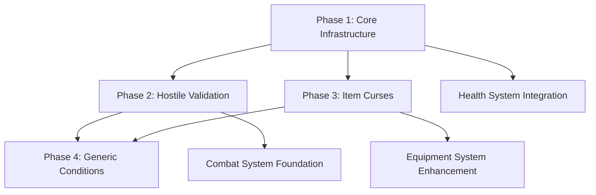

# Action Validation System Implementation Specification

## Overview

The Action Validation System is a foundational middleware layer that checks conditions and requirements before allowing player actions in Shadow Kingdom. It serves as a gatekeeper that can prevent actions based on game state, character conditions, environmental factors, and item properties.

## Implementation Phases

### Phase 1: Core Infrastructure and Death State Validation
**Priority: High** - Foundation for all other validation

#### Components to Implement:
1. **ActionValidator Service** (`src/services/actionValidator.ts`)
   - Core validation engine with pluggable condition checks
   - Main `canPerformAction()` method
   - Basic error handling and result formatting

2. **ValidationResult Interface** (`src/types/validation.ts`)
   ```typescript
   interface ValidationResult {
     allowed: boolean;
     reason?: string;
     hint?: string;
     blocker?: any;
   }
   
   interface ActionContext {
     roomId: number;
     characterId: number;
     itemId?: number;
     direction?: string;
     targetId?: any;
   }
   ```

3. **Database Schema Updates** (`src/utils/initDb.ts`)
   - Add basic tables for future phases (create empty, populated later)

4. **Death State Validation**
   - Prevent all actions when character is dead (except respawn-related)
   - Integration with Character System's `is_dead` field

#### Integration Points:
- **GameController**: Add validation before action execution
- **Character Service**: Check death state
- **Service Factory**: Include ActionValidator in service injection

#### Acceptance Criteria:
- [ ] ActionValidator service created and integrated
- [ ] Death state prevents actions with clear error messages
- [ ] All existing commands check validation before executing
- [ ] Tests cover basic validation scenarios
- [ ] No breaking changes to existing functionality

---

### Phase 2: Hostile Presence Validation
**Priority: High** - Enables NPC/enemy interaction restrictions

#### Components to Implement:
1. **room_hostiles Table Schema**
   ```sql
   CREATE TABLE room_hostiles (
     id INTEGER PRIMARY KEY AUTOINCREMENT,
     room_id INTEGER NOT NULL,
     character_id INTEGER NOT NULL,
     blocks_rest BOOLEAN DEFAULT TRUE,
     blocks_movement TEXT,            -- JSON array of blocked directions
     threat_level INTEGER DEFAULT 1,
     threat_message TEXT,
     created_at DATETIME DEFAULT CURRENT_TIMESTAMP,
     FOREIGN KEY (room_id) REFERENCES rooms(id) ON DELETE CASCADE,
     FOREIGN KEY (character_id) REFERENCES characters(id) ON DELETE CASCADE
   );
   ```

2. **Hostile Validation Methods**
   - `checkHostilesBlockingRest()`: Check for enemies preventing rest
   - `checkMovementBlockers()`: Check for enemies blocking exits
   - Support for custom threat messages per hostile

3. **Rest Command Integration**
   - Validate no hostiles are present before allowing rest
   - Display helpful error messages with enemy names

#### Test Data Setup:
- Create sample hostile NPCs in test rooms
- Test various hostile configurations (rest blockers, movement blockers)

#### Acceptance Criteria:
- [ ] Hostile entities can be placed in rooms via database
- [ ] Rest command blocked when hostiles present
- [ ] Clear error messages identify blocking entities
- [ ] Movement can be blocked by hostiles (basic implementation)
- [ ] Integration tests cover hostile scenarios

---

### Phase 3: Item Curse System
**Priority: Medium** - Enables cursed/sticky items

#### Components to Implement:
1. **item_curses Table Schema**
   ```sql
   CREATE TABLE item_curses (
     id INTEGER PRIMARY KEY AUTOINCREMENT,
     item_id INTEGER NOT NULL UNIQUE,
     curse_type TEXT NOT NULL,        -- 'sticky', 'heavy', 'disturbing', 'blocking'
     prevents_actions TEXT NOT NULL,  -- JSON array ['drop', 'unequip', 'rest']
     curse_message TEXT NOT NULL,
     removal_condition TEXT,
     created_at DATETIME DEFAULT CURRENT_TIMESTAMP,
     FOREIGN KEY (item_id) REFERENCES items(id) ON DELETE CASCADE
   );
   ```

2. **Curse Validation Methods**
   - `checkItemCurses()`: Check if item prevents specific actions
   - `checkItemsBlockingRest()`: Check for disturbing items in inventory
   - JSON parsing for flexible action prevention

3. **Integration with Item Commands**
   - Drop command: Check for sticky curses
   - Unequip command: Check for binding curses
   - Rest command: Check for disturbing items

#### Example Curse Configurations:
```sql
-- Cursed ring that can't be dropped
INSERT INTO item_curses (item_id, curse_type, prevents_actions, curse_message)
VALUES (42, 'sticky', '["drop", "unequip"]', 'The cursed ring seems fused to your finger!');

-- Screaming skull that prevents rest
INSERT INTO item_curses (item_id, curse_type, prevents_actions, curse_message) 
VALUES (66, 'disturbing', '["rest"]', 'The screaming skull torments your mind, preventing rest.');
```

#### Acceptance Criteria:
- [ ] Items can have curses that prevent specific actions
- [ ] Cursed items cannot be dropped/unequipped with appropriate messages
- [ ] Disturbing items prevent rest when in inventory
- [ ] Curse system is flexible and data-driven
- [ ] Tests cover various curse scenarios

---

### Phase 4: Generic Condition System  
**Priority: Low** - Advanced validation for complex scenarios

#### Components to Implement:
1. **action_conditions Table Schema**
   ```sql
   CREATE TABLE action_conditions (
     id INTEGER PRIMARY KEY AUTOINCREMENT,
     entity_type TEXT NOT NULL,      -- 'room', 'connection', 'item', 'character'
     entity_id INTEGER NOT NULL,
     action_type TEXT NOT NULL,      -- 'move', 'rest', 'pickup', 'drop', 'use', 'equip'
     condition_type TEXT NOT NULL,   -- 'hostile_present', 'item_required', etc.
     condition_data TEXT,            -- JSON data for condition specifics
     failure_message TEXT NOT NULL,
     hint_message TEXT,
     priority INTEGER DEFAULT 0,
     created_at DATETIME DEFAULT CURRENT_TIMESTAMP
   );
   ```

2. **Generic Condition Engine**
   - `evaluateCondition()`: Parse and check individual conditions
   - `getActionConditions()`: Query relevant conditions for an action
   - Support for multiple condition types and complex logic

3. **Condition Types Implementation**
   - ITEM_REQUIRED: Must possess specific item
   - ITEM_FORBIDDEN: Cannot carry specific item
   - ATTRIBUTE_CHECK: Stat requirements (STR > 15, etc.)
   - HEALTH_CHECK: HP threshold requirements

#### Acceptance Criteria:
- [ ] Generic conditions can be defined in database
- [ ] Multiple condition types supported and tested
- [ ] Complex scenarios work (item requirements, stat checks)
- [ ] Performance is acceptable for frequent validation calls
- [ ] Documentation includes condition type reference

---

## Implementation Order and Dependencies



## Integration Strategy

### GameController Integration Pattern
```typescript
// Standard pattern for action validation in commands
private async validateAndExecuteAction(
  actionType: string, 
  context: ActionContext,
  executeAction: () => Promise<void>
): Promise<void> {
  const validation = await this.actionValidator.canPerformAction(
    actionType,
    this.character,
    context
  );

  if (!validation.allowed) {
    this.tui.display(validation.reason!, MessageType.ERROR);
    if (validation.hint) {
      this.tui.display(`Hint: ${validation.hint}`, MessageType.SYSTEM);
    }
    return;
  }

  await executeAction();
}
```

### Service Factory Updates
```typescript
// Add ActionValidator to service dependencies
export class ServiceFactory {
  private actionValidator?: ActionValidator;

  getActionValidator(): ActionValidator {
    if (!this.actionValidator) {
      this.actionValidator = new ActionValidator(
        this.getDatabase(),
        this.getCharacterService()
      );
    }
    return this.actionValidator;
  }
}
```

## Testing Strategy

### Unit Tests (`tests/actionValidator.test.ts`)
- Test each validation method independently
- Mock database responses for consistent testing
- Cover edge cases and error conditions
- Test validation result formatting

### Integration Tests (`tests/actionValidation-integration.test.ts`)  
- Test validation with real database
- Test command integration (rest, move, drop, etc.)
- Test complex scenarios with multiple conditions
- Test performance with realistic data volumes

### Example Test Structure:
```typescript
describe('ActionValidator', () => {
  describe('Death State Validation', () => {
    test('should prevent actions when character is dead');
    test('should allow respawn-related actions when dead');
  });

  describe('Hostile Validation', () => {
    test('should prevent rest when hostiles present');
    test('should allow rest when no hostiles');
    test('should block movement when hostile guards exit');
  });

  describe('Item Curse Validation', () => {
    test('should prevent dropping cursed items');
    test('should prevent rest with disturbing items');
  });
});
```

## Performance Considerations

### Database Query Optimization
- Index frequently queried columns (room_id, character_id)
- Limit queries to necessary data only
- Cache validation results for repeated checks within same action

### Validation Ordering
- Check fastest conditions first (character state)
- Check most likely to fail conditions early
- Avoid expensive database queries when possible

### Memory Management
- Don't hold large result sets in memory
- Clean up database connections properly
- Use prepared statements for repeated queries

## Error Handling and User Experience

### Error Message Guidelines
- **Clear and Specific**: "The troll blocks the north exit!" not "Movement denied"
- **Actionable Hints**: "Defeat or distract the hostile to pass"
- **Consistent Tone**: Match existing game narrative style
- **Context Aware**: Include entity names and specific details

### Hint System
- Provide helpful suggestions for overcoming blockers
- Avoid spoilers but give meaningful direction
- Optional hints that don't clutter the interface
- Context-sensitive based on game state

## Future Extensions

### Planned Enhancements
- **Time-based Conditions**: Cooldowns, day/night restrictions
- **Quest Integration**: Story progression requirements
- **Attribute Scaling**: Dynamic difficulty based on character stats  
- **Environmental Hazards**: Weather, terrain, magical effects
- **Social Systems**: Reputation requirements, faction restrictions

### Integration Points
- **Event Trigger System**: Validation runs before triggers fire
- **Combat System**: Attack validation, defense requirements
- **Quest System**: Objective completion requirements
- **NPC System**: Interaction restrictions and permissions

## Success Metrics

### Technical Metrics
- All existing functionality preserved during integration
- Test coverage > 95% for validation logic
- Average validation time < 10ms per check
- Zero performance regression in command execution

### Gameplay Metrics  
- Rich error messages provide clear feedback
- Hint system helps players understand restrictions
- Complex scenarios work reliably (cursed items, hostile blocking)
- System feels natural and enhances rather than frustrates gameplay

## Implementation Checklist

### Phase 1 Completion Criteria:
- [ ] ActionValidator service implemented and tested
- [ ] ValidationResult interface defined
- [ ] Death state validation working
- [ ] Integration with all existing commands
- [ ] Full test coverage for core functionality
- [ ] Performance benchmarks established
- [ ] Documentation updated

### Ready for Phase 2 When:
- [ ] All Phase 1 tests pass
- [ ] No performance regressions
- [ ] Code review completed
- [ ] Integration with Character System stable
- [ ] Error handling robust and user-friendly