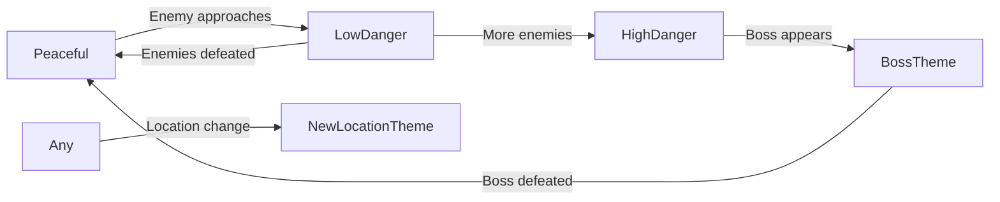

# Shadow Kingdom Music System Documentation

## Overview

Shadow Kingdom features a dynamic, procedurally-generated 8-bit music system that responds to gameplay in real-time. The music is created using the Web Audio API, generating all sounds programmatically without any audio files.

## Core Architecture

### Music Generation Engine

The system uses Web Audio oscillators to generate music in real-time:
- **No audio files** - all music is synthesized
- **8-bit aesthetic** - square, triangle, sine, and sawtooth waveforms
- **Dynamic composition** - music changes based on game state

### Key Components

1. **Location Themes** - Each area has unique musical character
2. **Boss Leitmotifs** - Memorable themes for each boss that replace the main melody
3. **Dynamic Intensity** - Music responds to nearby threats
4. **Atmospheric Layers** - Ambient sounds that enhance location identity

## Location Themes

Each game area has a distinct musical identity defined by:

### Theme Structure
```javascript
{
  name: 'Forest',
  bpm: 96,                              // Tempo
  timeSignature: [4, 4],                // Time signature
  scale: [0, 2, 4, 5, 7, 9, 11],       // Musical scale (intervals)
  chordProg: [0, 5, 3, 0, -2, 5, -2, 0], // Chord progression
  bassPattern: [0, 0, 7, 0, 0, 0, 7, 0], // Bass rhythm
  melody: {
    main: [0, 2, 4, 7, 9, 7, 4, 2],     // Primary melody
    variation: [9, 7, 5, 4, 2, 0, 2, 4], // Alternate melody
    intense: [11, 9, 7, 11, 12, 11, 9, 7] // Combat melody
  },
  filter: { base: 1800, range: 600 },   // Filter sweep parameters
  drums: {
    kick: [0, 4],                        // Kick drum positions
    snare: [],                           // Snare positions
    hat: { pattern: [0, 2, 4, 6] }      // Hi-hat pattern
  },
  atmosphere: 'birds',                  // Ambient sound type
  waveforms: { bass: 'sine', lead: 'triangle' }
}
```

### Available Locations

| Location | Musical Character | Key Features |
|----------|------------------|--------------|
| **Original** | Dorian mode, classic 8-bit | The original theme from early development |
| **Forest** | Major scale, peaceful | Bird chirps, gentle rhythm |
| **Cave** | Locrian (diminished), dark | Echo reverb, sparse, water drips |
| **Marsh** | Lydian (mystical), mysterious | Syncopated rhythm, bubble sounds |
| **City** | Dorian with blues notes | Complex drums, busy arrangement |
| **Castle** | Harmonic minor, regal | March-like, church bells |
| **Temple** | Whole tone, ethereal | No drums, wind chimes, meditative |

## Dynamic Music System

### Proximity-Based Intensity

The music dynamically responds to threats within certain ranges:

```
Player <--150px--> Boss     = Boss theme takes over melody
Player <--100px--> Enemies  = Danger music intensity
Player alone                = Peaceful music
```

### Three Intensity Modes

1. **Normal (Peaceful)**
   - Default exploration music
   - Calm, lower volume
   - Sparse percussion

2. **Low Danger**
   - 1-2 regular enemies nearby
   - Slightly faster filter sweep
   - Additional percussion

3. **High Danger**
   - Featured enemy or 3+ enemies nearby
   - Intense melody variations
   - Full drum kit, higher volume

### Music State Transitions



## Boss Music System

### Integrated Leitmotifs

When a boss is encountered, their unique theme **replaces** the main melody (not layered over it):

| Boss | Musical Theme | Character |
|------|--------------|-----------|
| **Vast** | Descending chromatic | Menacing doom |
| **Nethra** | Tritone intervals | Mysterious, unsettling |
| **Luula** | Major 7th arpeggios | Ethereal, floating |
| **Vanificia** | Waltz in minor | Deceptive elegance |
| **Vorthak** | Power chord stabs | Brutal, aggressive |
| **Fana** | Minor pentatonic | Martial, disciplined |

### Boss Theme Structure

Each boss theme includes:
- **8-note melody** - Their signature musical phrase
- **Harmony line** - Supporting bass melody
- **Custom scale** - Unique tonal palette
- **Filter adjustment** - Darker or brighter tone
- **Waveform selection** - Matching their character

## Technical Implementation

### Music Loop Structure

```
Total Loop = 16 bars (8 bars Section A + 8 bars Section B)
Each bar = 8 steps (eighth notes)
Total steps = 128 per complete loop

Section A: Root key, primary melodies
Section B: Modulated up, variation melodies
```

### Scheduling System

The music runs on a precise timer using `setInterval`:
1. Calculate current bar and step position
2. Determine section (A or B)
3. Select appropriate chord from progression
4. Play drums, bass, and melody for this step
5. Apply filter sweeps and effects
6. Check for companion layers
7. Advance to next step

### Web Audio Graph

```
Oscillator --> Gain --> Filter --> Master Gain --> Destination
                |                       ^
                v                       |
            ADSR Envelope           Mute/Volume
```

### Performance Optimization

- **Object pooling** - Reuse audio nodes
- **Lazy initialization** - Create context on first user interaction
- **Debouncing** - 1.5 second delay between music changes
- **Atmosphere cleanup** - Clear timers when stopping music

## Atmospheric Sounds

Location-specific ambient sounds that play randomly:

| Location | Atmosphere | Implementation |
|----------|------------|----------------|
| Forest | Bird chirps | Random sine wave chirps every 3-5 seconds |
| Cave | Water drips | Single tone with long release |
| Marsh | Bubbles | Noise bursts with soft attack |
| Castle | Church bells | Harmonic series with long decay |
| Temple | Wind chimes | Random pentatonic notes |

## Companion System

When companions join the party, subtle melodic layers are added:

```javascript
{
  elara: { sequence: [0, 3, 5, 7], waveform: 'triangle' },
  kael: { sequence: [0, 0, 7, 5], waveform: 'square' },
  myra: { sequence: [0, 2, 4, 2], waveform: 'sine' }
}
```

These play every 4 steps at lower volume, adding richness without overwhelming.

## API Functions

### Core Controls

```javascript
// Change location theme
setMusicLocation('forest')

// Trigger boss music
setBossEncounter('vast')

// Set intensity manually
setMusicMode('high')  // 'normal', 'low', 'high'

// Add/remove companion themes
addCompanionLayer('elara')
removeCompanionLayer('elara')

// Toggle music system
toggleMusic()
toggleChipMode()  // Switch between chip and file mode
```

### Integration Points

The music system integrates with:
- **Level loading** - Each level sets its music theme
- **Combat system** - Proximity detection in step.js
- **Save system** - Music state preserved/restored
- **UI controls** - Volume, mute, music toggle

## Music Patterns

### Chord Progressions

Progressions use semitone offsets from root:
- `0` = Root
- `5` = Fourth above
- `-2` = Major seventh below
- `7` = Fifth above

### Melody Patterns

Melodies use scale degrees (0-based indices into the scale array):
- `[0, 2, 4, 7]` = Root, 3rd, 5th, octave (in major: C, E, G, C)

### Bass Patterns

Bass typically plays root (0) or fifth (7):
- `[0, 0, 7, 0, 0, 0, 7, 0]` = Standard 8-beat pattern

## Troubleshooting

### Common Issues

1. **Music doesn't stop on pause**
   - Atmosphere timers are tracked separately
   - All timers cleared in `stopMusic()`

2. **Odd looping/periodicity**
   - Ensure all patterns are 8 steps or properly divide
   - Check bar calculations in schedule function

3. **Boss music continues after leaving**
   - Proximity system updates every frame
   - Debouncing prevents instant changes

4. **No sound**
   - Web Audio requires user interaction first
   - Check if `musicEnabled` and `useChip` are true

## Future Enhancements

Potential improvements to the music system:

1. **Vertical remixing** - Add/remove instrument layers dynamically
2. **Stinger system** - Short musical cues for events
3. **Interactive music** - Player actions influence composition
4. **Procedural variations** - AI-generated melody variations
5. **Custom waveforms** - More complex timbres using wave shaping
6. **Reverb zones** - Different reverb per location
7. **Musical puzzles** - Gameplay elements using music theory