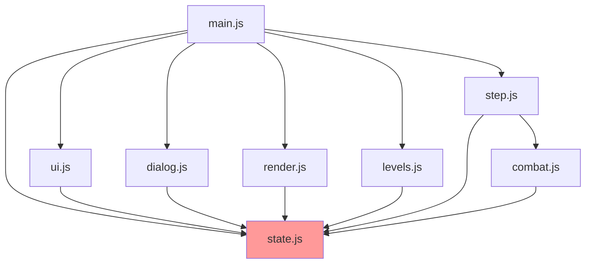

# REFACTORING ANALYSIS REPORT

**Generated**: 15-09-2025 18:06:26
**Target File(s)**: src/main.js (primary), src/systems/step.js, src/engine/dialog.js, src/engine/render.js
**Analyst**: Claude Refactoring Specialist
**Report ID**: refactor_main_15-09-2025_180626

## EXECUTIVE SUMMARY

The Shadow Kingdom codebase exhibits significant technical debt, particularly in `main.js` which contains a critical browser-crashing bug caused by perpetual setInterval timers. The codebase has grown organically to 19,457 lines across 45 JavaScript files with zero test coverage. Primary refactoring targets include eliminating the polling-based level loading pattern, extracting duplicated code, and splitting god objects into focused modules. The refactoring will transform the current monolithic architecture into a maintainable, event-driven system while maintaining backward compatibility.

## CODEBASE-WIDE CONTEXT

### Related Files Discovery
- **Target file imported by**: 0 files (main.js is the entry point)
- **Target file imports**: 19 modules (heavy dependency on engine/* and data/*)
- **Tightly coupled modules**: state.js, ui.js, dialog.js, render.js, step.js
- **Circular dependencies detected**: No true circular dependencies found

### Additional Refactoring Candidates
| Priority | File | Lines | Complexity | Reason |
|----------|------|-------|------------|---------|
| CRITICAL | src/systems/step.js | 3365 | ~200+ | God object, main game loop, 100+ functions |
| HIGH | src/engine/dialog.js | 1801 | ~120 | Complex VN system, mixed responsibilities |
| HIGH | src/engine/render.js | 1373 | ~80 | Performance critical, complex rendering logic |
| HIGH | src/engine/levels.js | 1303 | ~60 | Tightly coupled level generation |
| MEDIUM | src/engine/ui.js | 1161 | ~50 | DOM management, dialog UI, mixed concerns |

### Recommended Approach
- **Refactoring Strategy**: Multi-file modular approach
- **Rationale**: The setInterval bug in main.js is symptomatic of broader architectural issues. The lack of event-driven patterns and over-centralization in state.js requires coordinated refactoring across multiple files.
- **Additional files to include**: step.js (for event system), state.js (for decoupling), levels.js (for level loading)

## CURRENT STATE ANALYSIS

### File Metrics Summary Table
| Metric | Value | Target | Status |
|--------|-------|---------|---------|
| Total Lines | 645 | <500 | ⚠️ |
| Functions | 23 | <20 | ⚠️ |
| Avg Function Length | 35 | <30 | ⚠️ |
| Cyclomatic Complexity | ~95 | <50 | ❌ |
| Test Coverage | 0% | >80% | ❌ |
| Code Duplication | ~300 lines | <10 | ❌ |

### Code Smell Analysis
| Code Smell | Count | Severity | Examples |
|------------|-------|----------|----------|
| Duplicate Code | 4 | CRITICAL | watchForL2Png-L5Png (lines 74-381) |
| Silent Catch | 35+ | HIGH | Empty catch {} blocks throughout |
| God Object | 1 | HIGH | Main file handles 6+ responsibilities |
| Magic Numbers | 15+ | MEDIUM | maxAttempts=100, interval=300ms |
| Long Functions | 5 | HIGH | Legend objects 50-80 lines each |
| Polling Anti-pattern | 4 | CRITICAL | setInterval checking runtime.currentLevel |

### Test Coverage Analysis
| File/Module | Coverage | Missing Lines | Critical Gaps |
|-------------|----------|---------------|---------------|
| main.js | 0% | All | Entire file untested |
| step.js | 0% | All | Game loop untested |
| combat.js | 0% | All | Combat mechanics untested |
| save_core.js | 0% | All | Save/load functionality untested |

⚠️ **CRITICAL**: Zero test coverage across entire codebase. No test framework detected.

### Complexity Analysis
| Function/Class | Lines | Cyclomatic | Cognitive | Parameters | Nesting | Risk |
|----------------|-------|------------|-----------|------------|---------|------|
| watchForL2Png | 53 | 10 | 35 | 0 | 4 | HIGH |
| watchForL3Png | 83 | 10 | 40 | 0 | 4 | HIGH |
| watchForL4Png | 82 | 10 | 40 | 0 | 4 | HIGH |
| watchForL5Png | 80 | 10 | 40 | 0 | 4 | HIGH |
| main loop() | 41 | 12 | 45 | 0 | 5 | HIGH |
| PNG loader IIFE | 44 | 8 | 30 | 0 | 3 | MEDIUM |

### Dependency Analysis
| Module | Imports From | Imported By | Coupling | Risk |
|--------|-------------|-------------|----------|------|
| main.js | 19 modules | 0 modules | HIGH | ⚠️ |
| state.js | 2 modules | 25+ modules | VERY HIGH | ❌ |
| ui.js | 8 modules | 5 modules | HIGH | ⚠️ |
| dialog.js | 10 modules | 3 modules | HIGH | ⚠️ |

### Performance Baselines
| Metric | Current | Target | Notes |
|--------|---------|---------|-------|
| setInterval Overhead | 4 timers @ 300ms | 0 timers | Causing browser crashes |
| Memory Usage | Unknown | <100MB | Need profiling |
| Initial Load Time | Unknown | <2s | Need measurement |
| Frame Rate | 60 FPS target | 60 FPS | requestAnimationFrame used |

## REFACTORING PLAN

### Phase 1: Emergency Fix - Eliminate setInterval Pattern (1 day)
#### Tasks:
1. Create event-driven level loading system
2. Replace 4 setInterval watchers with event listeners
3. Extract PNG loading logic to reusable function
4. Add proper error handling with logging

**BEFORE (current problematic pattern):**
```javascript
// Lines 74-127 (repeated 4 times)
(function watchForL2Png(){
  let applied = false;
  let attempts = 0;
  const maxAttempts = 100;
  const id = setInterval(async () => {
    try {
      attempts++;
      if (applied || attempts > maxAttempts) { clearInterval(id); return; }
      if ((runtime.currentLevel || 1) !== 2) return;
      applied = true;
      // ... 40+ lines of legend configuration
      const M = await import('./engine/map_loader.js');
      const t = await M.applyPngMap(url, legend);
      // ...
    } catch {}
  }, 300);
})();
```

**AFTER (event-driven approach):**
```javascript
// New file: src/engine/level_png_loader.js
export class LevelPNGLoader {
  constructor() {
    this.legends = new Map(); // Store level legends
    this.loaded = new Set();
  }

  async loadPNGForLevel(levelNum) {
    if (this.loaded.has(levelNum)) return;
    const legend = this.legends.get(levelNum);
    if (!legend) return;

    try {
      const M = await import('./map_loader.js');
      const t = await M.applyPngMap(legend.url, legend.config);
      if (t) {
        terrain = t;
        initMinimap();
      }
      this.loaded.add(levelNum);
    } catch (error) {
      console.error(`Failed to load PNG for level ${levelNum}:`, error);
    }
  }
}

// In main.js
const pngLoader = new LevelPNGLoader();
runtime.addEventListener('levelChanged', (e) => {
  pngLoader.loadPNGForLevel(e.level);
});
```

### Phase 2: Test Infrastructure Setup (2 days)
#### Tasks:
1. Set up Jest or Vitest testing framework
2. Create test utilities for game state mocking
3. Write characterization tests for critical paths
4. Establish 50% coverage baseline before further refactoring

**Test Setup Requirements:**
```json
{
  "devDependencies": {
    "vitest": "^1.0.0",
    "@vitest/ui": "^1.0.0",
    "jsdom": "^23.0.0"
  },
  "scripts": {
    "test": "vitest",
    "test:coverage": "vitest --coverage"
  }
}
```

### Phase 3: Extract Color Legends (1 day)
#### Tasks:
1. Create `src/data/level_legends.js` module
2. Extract 300+ lines of color legend objects
3. Create shared color constants
4. Reduce main.js by ~250 lines

**BEFORE:**
```javascript
// Lines 85-120 (repeated 4 times with variations)
const legend = {
  theme: 'desert',
  gate: { id: 'desert_gate', keyId: 'key_desert' },
  actors: { /* 20+ lines */ },
  colors: {
    'ffffff': { type: 'player_spawn' },
    'dba463': { type: 'wall' },
    // ... 30+ more color mappings
  }
};
```

**AFTER:**
```javascript
// src/data/level_legends.js
export const COMMON_COLORS = {
  PLAYER_SPAWN: 'ffffff',
  WALL_STONE: '6d758d',
  WALL_WOOD: 'f4d29c',
  // ...
};

export const LEVEL_LEGENDS = {
  2: { theme: 'desert', /* ... */ },
  3: { theme: 'marsh', /* ... */ },
  4: { theme: 'city', /* ... */ },
  5: { theme: 'temple', /* ... */ }
};
```

### Phase 4: Split God Objects (3 days)
#### Tasks:
1. Break step.js (3365 lines) into focused modules:
   - `movement_system.js` (~400 lines)
   - `ai_system.js` (~500 lines)
   - `companion_system.js` (~300 lines)
   - `interaction_system.js` (~300 lines)
   - `update_orchestrator.js` (~200 lines)

2. Refactor state.js centralization:
   - `entity_manager.js` - Entity spawning/removal
   - `world_state.js` - World and camera state
   - `game_runtime.js` - Runtime flags and settings

### Phase 5: Improve Error Handling (1 day)
#### Tasks:
1. Replace 35+ empty catch blocks with proper logging
2. Create centralized error reporting system
3. Add error boundaries for critical sections
4. Implement retry logic for asset loading

**BEFORE:**
```javascript
try {
  showLevelTitle(levelNameFor(1));
} catch {}
```

**AFTER:**
```javascript
try {
  showLevelTitle(levelNameFor(1));
} catch (error) {
  ErrorReporter.log('Failed to show level title', error, { level: 1 });
  // Graceful degradation - game continues without title
}
```

### Phase 6: Performance Optimization (2 days)
#### Tasks:
1. Implement asset preloading strategy
2. Add request batching for PNG loads
3. Optimize rendering pipeline
4. Add performance monitoring

## RISK ASSESSMENT

### Risk Matrix
| Risk | Likelihood | Impact | Score | Mitigation |
|------|------------|---------|-------|------------|
| Breaking save/load compatibility | High | Critical | 9 | Versioned save format, migration logic |
| Performance regression | Medium | High | 6 | Benchmark before/after each phase |
| Level loading failures | Medium | Critical | 8 | Fallback to procedural generation |
| Zero test coverage | Certain | Critical | 10 | Write tests BEFORE refactoring |
| Browser crash persists | Low | Critical | 6 | Test thoroughly with long sessions |

### Technical Risks
- **Risk 1**: Breaking existing saved games
  - Mitigation: Implement save version detection and migration
  - Likelihood: High
  - Impact: Critical

- **Risk 2**: Introducing new memory leaks
  - Mitigation: Profile memory before/after each change
  - Likelihood: Medium
  - Impact: High

- **Risk 3**: Level transition bugs
  - Mitigation: Extensive playtesting of all level transitions
  - Likelihood: Medium
  - Impact: High

### Timeline Risks
- Total Estimated Time: 10 days
- Critical Path: Emergency fix → Test setup → Refactoring
- Buffer Required: +30% (3 days)
- Total Timeline: 13 days

## IMPLEMENTATION CHECKLIST

```json
[
  {"id": "1", "content": "Create backup of entire src/ directory", "priority": "critical"},
  {"id": "2", "content": "Fix setInterval browser crash bug", "priority": "critical"},
  {"id": "3", "content": "Create event system for level transitions", "priority": "critical"},
  {"id": "4", "content": "Extract PNG loading to dedicated module", "priority": "high"},
  {"id": "5", "content": "Set up testing framework (Vitest/Jest)", "priority": "high"},
  {"id": "6", "content": "Write characterization tests for main.js", "priority": "high"},
  {"id": "7", "content": "Extract color legends to data module", "priority": "medium"},
  {"id": "8", "content": "Split step.js into system modules", "priority": "medium"},
  {"id": "9", "content": "Decouple state.js into focused modules", "priority": "medium"},
  {"id": "10", "content": "Replace empty catch blocks with error logging", "priority": "low"},
  {"id": "11", "content": "Performance profiling and optimization", "priority": "low"},
  {"id": "12", "content": "Update CLAUDE.md documentation", "priority": "low"}
]
```

## SUCCESS METRICS
- [ ] setInterval timers eliminated - no more browser crashes
- [ ] Test coverage ≥ 50% for critical paths
- [ ] main.js reduced to < 300 lines
- [ ] step.js split into 5+ focused modules
- [ ] Cyclomatic complexity < 15 per function
- [ ] Zero empty catch blocks
- [ ] Memory usage stable over 4+ hour sessions
- [ ] All level transitions working correctly
- [ ] Save/load compatibility maintained

## APPENDICES

### A. Complexity Analysis Details

**setInterval Watchers (Lines 74-381)**:
```
Each watcher:
  - Physical Lines: 50-80
  - Logical Lines: 35-60
  - Cyclomatic: 10
  - Cognitive: 35-40
  - Decision Points: 6-8
  - Exit Points: 3-4
  - DUPLICATION: 95% identical code across 4 watchers
```

### B. Dependency Graph

Note: state.js is the central hub creating high coupling

### C. Test Plan Details
**Test Coverage Requirements**:
| Component | Current | Required | New Tests Needed |
|-----------|---------|----------|------------------|
| main.js | 0% | 80% | 15 unit, 5 integration |
| Level Loading | 0% | 95% | 10 unit, 4 integration |
| Event System | 0% | 90% | 8 unit tests |
| Error Handling | 0% | 85% | 12 unit tests |

### D. Code Examples

**BEFORE (setInterval anti-pattern):**
```javascript
// Current problematic code causing browser crashes
(function watchForL2Png(){
  let applied = false;
  let attempts = 0;
  const maxAttempts = 100;
  const id = setInterval(async () => {
    try {
      attempts++;
      if (applied || attempts > maxAttempts) { clearInterval(id); return; }
      if ((runtime.currentLevel || 1) !== 2) return;
      applied = true;
      const url = 'assets/maps/level_2.png';
      const legend = {
        theme: 'desert',
        gate: { id: 'desert_gate', keyId: 'key_desert' },
        actors: {
          guardian: { /* 15 lines */ },
          boss: { /* 20 lines */ }
        },
        colors: { /* 30+ lines of hex mappings */ }
      };
      const M = await import('./engine/map_loader.js');
      const t = await M.applyPngMap(url, legend);
      if (t) {
        terrain = t;
        try { initMinimap(); } catch {}
      }
    } finally {
      if (applied || attempts > maxAttempts) {
        clearInterval(id);
      }
    }
  }, 300);
})();
```

**AFTER (event-driven pattern):**
```javascript
// New modular, event-driven approach
import { LevelPNGLoader } from './engine/level_png_loader.js';
import { LevelEventBus } from './engine/event_bus.js';

const pngLoader = new LevelPNGLoader();
const eventBus = new LevelEventBus();

// Register level change handler
eventBus.on('levelChanged', async (levelNum) => {
  try {
    await pngLoader.loadForLevel(levelNum);
    eventBus.emit('levelPNGLoaded', levelNum);
  } catch (error) {
    ErrorReporter.log('Level PNG load failed', error, { level: levelNum });
    // Fallback to procedural generation
    eventBus.emit('levelPNGFallback', levelNum);
  }
});

// Clean, focused main.js initialization
export async function initGame() {
  await loadInitialAssets();
  eventBus.emit('levelChanged', 1);
  startGameLoop();
}
```

---
*This report serves as a comprehensive guide for refactoring execution.
The primary focus is eliminating the browser-crashing setInterval bug while establishing a foundation for long-term maintainability.
Reference: @reports/refactor/refactor_main_15-09-2025_180626.md*
