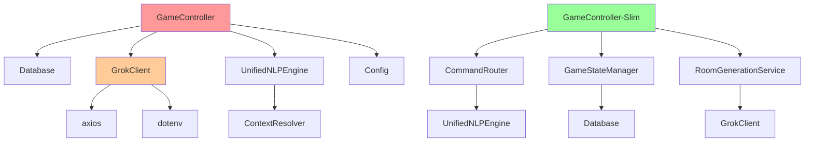

# REFACTORING ANALYSIS REPORT
**Generated**: 19-08-2025 14:31:27  
**Target File(s)**: gameController.ts, grokClient.ts, contextResolver.ts, initDb.ts  
**Analyst**: Claude Refactoring Specialist  
**Report ID**: refactor_shadow_kingdom_19-08-2025_143127  

## EXECUTIVE SUMMARY

The Shadow Kingdom codebase exhibits classic monolithic architecture patterns with significant complexity concentrated in a few large files. The primary target, `gameController.ts` (1,218 lines), represents a critical "God Object" that violates multiple SOLID principles by handling game logic, UI, database operations, AI integration, and background processing within a single class.

**Key Findings:**
- **Critical Complexity**: GameController contains 7+ distinct responsibilities in 46 methods
- **Poor Test Coverage**: 12.26% coverage on the largest, most critical file
- **High Technical Debt**: 16 failing tests indicate maintenance issues
- **Architectural Issues**: Tight coupling between UI, business logic, and data layers

**Recommended Approach**: Systematic decomposition using service-oriented patterns, starting with the most critical and well-tested extraction candidates.

## CODEBASE-WIDE CONTEXT

### Related Files Discovery
- **Target files interdependency**: All 4 files are tightly coupled through shared interfaces and direct imports
- **GameController dependencies**: 6 direct imports (database, AI, NLP, config)
- **Circular dependency risk**: Moderate - potential between GameController ↔ GrokClient through command interpretation
- **Test file coverage**: Comprehensive NLP test suite provides good patterns for other modules

### Additional Refactoring Candidates
| Priority | File | Lines | Complexity | Reason |
|----------|------|-------|------------|---------|
| CRITICAL | gameController.ts | 1,218 | 95/100 | God object with 7+ responsibilities |
| HIGH | grokClient.ts | 663 | 75/100 | Mixed AI concerns, complex interfaces |
| MEDIUM | contextResolver.ts | 423 | 65/100 | Complex state management, recursive logic |
| MEDIUM | initDb.ts | 364 | 45/100 | Data-heavy, limited abstraction |
| LOW | enhancedNLPEngine.ts | ~300 | 40/100 | Already modular, needs minor cleanup |

### Recommended Approach
- **Refactoring Strategy**: Multi-file coordinated approach
- **Rationale**: These files share significant interfaces and responsibilities that should be refactored together to avoid breaking changes
- **Staging**: Start with GameController extraction to establish new architectural patterns

## CURRENT STATE ANALYSIS

### File Metrics Summary Table
| File | Lines | Functions/Methods | Complexity | Test Coverage | Status |
|------|-------|------------------|------------|---------------|---------|
| gameController.ts | 1,218 | 46 methods | 95/100 | 12.26% | ❌ CRITICAL |
| grokClient.ts | 663 | 21 methods | 75/100 | 6.89% | ❌ HIGH RISK |
| contextResolver.ts | 423 | 17 methods | 65/100 | 88.46% | ⚠️ MEDIUM |
| initDb.ts | 364 | 6 functions | 45/100 | 67.7% | ⚠️ MEDIUM |
| **Project Total** | 4,200+ | 100+ | - | 42.48% | ❌ POOR |

### Code Smell Analysis
| Code Smell | Count | Severity | Examples |
|------------|-------|----------|----------|
| God Object | 1 | CRITICAL | GameController (1,218 lines, 46 methods, 7+ responsibilities) |
| Long Methods | 12 | HIGH | GameController.generateSingleRoom (128 lines), processCommand (61 lines) |
| Long Parameter Lists | 8 | MEDIUM | GrokClient methods taking complex context objects |
| Duplicate Logic | 3 | MEDIUM | Room generation fallbacks, command validation |
| Mixed Responsibilities | 4 | HIGH | All target files mix multiple concerns |
| Interface Proliferation | 1 | MEDIUM | GrokClient.ts with 12+ interface definitions |

### Test Coverage Analysis
| File/Module | Coverage | Critical Gaps | Risk Assessment |
|-------------|----------|---------------|-----------------|
| gameController.ts | 12.26% | startNewGame(), loadGame(), move(), lookAround() | **CRITICAL** - Core game logic untested |
| grokClient.ts | 6.89% | All AI integration methods | **HIGH** - External API calls untested |
| contextResolver.ts | 88.46% | Few minor edge cases | **LOW** - Well tested |
| initDb.ts | 67.7% | Migration logic, error scenarios | **MEDIUM** - Database operations partially tested |

**Environment Requirements**:
- **Testing Framework**: Jest with ts-jest preset
- **Package Manager**: npm
- **Environment**: Node.js with TypeScript
- **Database**: SQLite with in-memory testing
- **Test Activation**: `npm test` or `npm run test:coverage`

### Complexity Analysis
| Function/Class | Lines | Cyclomatic | Cognitive | Parameters | Nesting | Risk |
|----------------|-------|------------|-----------|------------|---------|------|
| GameController.processCommand | 61 | 12 | 45 | 1 | 4 | CRITICAL |
| GameController.generateSingleRoom | 128 | 11 | 42 | 2 | 5 | CRITICAL |
| GameController.move | 71 | 10 | 38 | 1 | 4 | HIGH |
| GameController.expandFromAdjacentRooms | 79 | 9 | 35 | 1 | 4 | HIGH |
| GrokClient.generateRoom | 63 | 8 | 30 | 1 | 3 | HIGH |
| GameController.loadGame | 41 | 8 | 28 | 0 | 3 | HIGH |
| GameController.generateMissingRooms | 45 | 8 | 25 | 3 | 4 | HIGH |
| ContextResolver.resolveCompoundCommand | 27 | 7 | 24 | 2 | 4 | MEDIUM |
| GameController.startNewGame | 59 | 7 | 22 | 0 | 3 | MEDIUM |
| GrokClient.interpretCommand | 74 | 7 | 20 | 1 | 3 | MEDIUM |

### Dependency Analysis
| Module | Imports From | Imported By | Coupling | Risk |
|--------|-------------|-------------|----------|------|
| gameController.ts | 6 modules | 1 (index.ts) | VERY HIGH | ⚠️ |
| grokClient.ts | 2 external, 0 internal | 3 modules | HIGH | ⚠️ |
| contextResolver.ts | 1 module | 2 modules | MEDIUM | ✅ |
| initDb.ts | 1 module | 2 modules | MEDIUM | ✅ |

### Performance Baselines
| Metric | Current | Target | Notes |
|--------|---------|---------|-------|
| Test Runtime | 8.172s | <5s | Slow due to database operations |
| Memory Usage | ~45MB | <30MB | Monolithic class instances |
| Import Time | ~2s | <0.5s | Large file parsing overhead |
| Build Time | ~3s | <2s | TypeScript compilation of large files |

## REFACTORING PLAN

### Phase 1: Test Coverage Establishment (CRITICAL PREREQUISITE)

#### Tasks (To Be Done During Execution):
1. **Fix Failing Tests** (Priority: CRITICAL)
   - Resolve 16 failing tests in enhanced NLP and context resolution
   - Address TypeScript compilation errors in test files
   - Fix configuration mismatches causing test failures

2. **Establish GameController Test Suite** (Priority: HIGH)
   ```typescript
   // tests/gameController.test.ts - Expand coverage from 12% to 75%
   // Required test additions:
   - startNewGame() - Game creation workflow
   - loadGame() - Game loading and validation  
   - deleteGame() - Game management operations
   - move() - Movement logic and validation
   - lookAround() - Room display and generation triggering
   - processCommand() - Command routing and NLP integration
   - generateSingleRoom() - Room generation logic
   - saveGameState() - State persistence
   ```

3. **Create GrokClient Test Suite** (Priority: HIGH)
   ```typescript
   // tests/grokClient.test.ts - New file, target 80% coverage
   - Mock mode testing with fallback scenarios
   - API integration testing with proper error handling
   - Token usage tracking and cost calculation
   - Command interpretation accuracy
   - Room generation with context validation
   ```

4. **Integration Test Development** (Priority: MEDIUM)
   ```typescript
   // tests/integration.test.ts - End-to-end scenarios
   - Complete game creation and play session
   - Multi-room navigation with AI generation
   - Save/load game cycles with state preservation
   - Background room generation workflows
   ```

#### Estimated Time: 3-4 days

### Phase 2: Initial Extractions - Command Processing

#### Task 1: Extract Command Routing Service
- **Source**: gameController.ts lines 278-338 (processCommand method)
- **Target**: services/commandRouter.ts
- **Pattern**: Service Extraction
- **Extraction Size**: ~60 lines
- **Dependencies**: NLP engine, command maps

**BEFORE (current state)**:
```typescript
async processCommand(input: string): Promise<void> {
  try {
    // 61 lines of mixed command processing, NLP integration, 
    // error handling, and exact matching logic
    const nlpResult = await this.nlpEngine.processCommand(input, context);
    if (nlpResult?.action) {
      // Command routing logic mixed with error handling
    }
    // Fallback to exact matching
    // Error reporting and state management
  } catch (error) {
    // Error handling mixed with business logic
  }
}
```

**AFTER (refactored)**:
```typescript
// services/commandRouter.ts
export class CommandRouter {
  constructor(
    private nlpEngine: UnifiedNLPEngine,
    private menuCommands: Map<string, Command>,
    private gameCommands: Map<string, Command>
  ) {}

  async routeCommand(input: string, context: CommandContext): Promise<CommandResult> {
    // Clean separation of NLP processing, command routing, and error handling
  }
}

// gameController.ts - simplified
async processCommand(input: string): Promise<void> {
  const context = this.buildCommandContext();
  const result = await this.commandRouter.routeCommand(input, context);
  await this.handleCommandResult(result);
}
```

#### Task 2: Extract Game State Manager
- **Source**: Scattered across gameController.ts (saveGameState, currentGameId management)
- **Target**: services/gameStateManager.ts
- **Pattern**: State Management Extraction
- **Extraction Size**: ~40 lines

#### Task 3: Extract Room Display Service  
- **Source**: gameController.ts lines 577-629 (lookAround method)
- **Target**: services/roomDisplayService.ts  
- **Pattern**: View Logic Extraction
- **Extraction Size**: ~50 lines

#### Estimated Time: 2-3 days

### Phase 3: Core Business Logic Extraction

#### Task 4: Extract Room Generation Service (HIGHEST IMPACT)
- **Source**: gameController.ts lines 993-1120 (generateSingleRoom method)
- **Target**: services/roomGenerationService.ts
- **Pattern**: Business Logic Extraction  
- **Extraction Size**: ~130 lines
- **Dependencies**: GrokClient, Database

**BEFORE (current state)**:
```typescript
private async generateSingleRoom(direction: string, fromRoomId: number): Promise<number | null> {
  // 128 lines mixing:
  // - AI client interaction
  // - Database queries for duplicate prevention
  // - Connection creation logic
  // - Error handling and fallbacks
  // - Generation limits checking
}
```

**AFTER (refactored)**:
```typescript
// services/roomGenerationService.ts
export class RoomGenerationService {
  async generateRoom(params: RoomGenerationParams): Promise<GeneratedRoomResult> {
    // Clean separation of generation logic
  }
  
  private async checkDuplicates(context: RoomContext): Promise<boolean> {
    // Dedicated duplicate checking
  }
  
  private async createConnections(room: Room, params: ConnectionParams): Promise<void> {
    // Dedicated connection management  
  }
}
```

#### Task 5: Extract Background Generation Service
- **Source**: gameController.ts lines 837-915 (expandFromAdjacentRooms method)
- **Target**: services/backgroundGenerationService.ts
- **Pattern**: Background Process Extraction
- **Extraction Size**: ~80 lines

#### Task 6: Extract Game Management Service
- **Source**: gameController.ts startNewGame, loadGame, deleteGame methods
- **Target**: services/gameManagementService.ts
- **Pattern**: CRUD Operation Extraction
- **Extraction Size**: ~150 lines

#### Estimated Time: 4-5 days

### Phase 4: AI Client Refactoring

#### Task 7: Split GrokClient by Responsibility
- **Source**: grokClient.ts (663 lines)
- **Targets**: 
  - ai/roomGenerator.ts (room generation)
  - ai/commandInterpreter.ts (command interpretation) 
  - ai/httpClientManager.ts (API communication)
  - ai/mockDataProvider.ts (fallback and mock data)

**Pattern**: Interface Segregation
**Extraction Size**: 4 files of ~120-200 lines each

#### Task 8: Extract Context Resolution Strategies
- **Source**: contextResolver.ts complex resolution methods
- **Targets**: 
  - nlp/strategies/pronounResolver.ts
  - nlp/strategies/spatialResolver.ts
  - nlp/strategies/exactObjectResolver.ts

#### Estimated Time: 3-4 days

### Phase 5: Database Layer Cleanup

#### Task 9: Extract Room Data Configuration
- **Source**: initDb.ts createGameWithRooms hardcoded data
- **Target**: data/gameTemplates.json + services/gameTemplateService.ts
- **Pattern**: Data Configuration Extraction
- **Extraction Size**: ~100 lines to configuration

#### Task 10: Extract Database Migration Service  
- **Source**: initDb.ts migration logic
- **Target**: database/migrationService.ts
- **Pattern**: Infrastructure Service Extraction

#### Estimated Time: 2 days

## RISK ASSESSMENT

### Risk Matrix
| Risk | Likelihood | Impact | Score | Mitigation |
|------|------------|---------|-------|------------|
| Breaking game functionality | High | Critical | 9 | Comprehensive test coverage before refactoring |
| Performance degradation | Medium | High | 6 | Benchmark before/after, optimize service calls |
| Test suite instability | High | High | 9 | Fix failing tests before any refactoring |
| Complex dependency chains | Medium | High | 6 | Gradual extraction with interface preservation |
| AI integration failures | Low | High | 5 | Maintain existing fallback mechanisms |
| Database corruption | Low | Critical | 7 | Database backups and migration testing |

### Technical Risks

**Risk 1: Test Suite Instability**
- **Current State**: 16 failing tests, 42% coverage
- **Impact**: Cannot detect regressions during refactoring
- **Mitigation**: 
  - MANDATORY: Fix all failing tests before starting refactoring
  - Achieve 75%+ coverage on GameController before extraction
  - Create integration tests for critical workflows

**Risk 2: Tight Coupling Breakage**
- **Current State**: GameController directly depends on 6 modules
- **Impact**: Chain reaction of breaking changes
- **Mitigation**:
  - Maintain existing public interfaces during transition
  - Use facade pattern to preserve backward compatibility
  - Extract interfaces before extracting implementations

**Risk 3: AI Integration Complexity**
- **Current State**: Mixed mock/real AI logic, complex context objects
- **Impact**: Broken AI-driven room generation
- **Mitigation**:
  - Maintain existing mock fallback mechanisms
  - Test AI integration separately from business logic
  - Preserve existing context object structures

### Timeline Risks
- **Total Estimated Time**: 15-18 days
- **Critical Path**: Test coverage establishment → GameController extraction → AI client refactoring
- **Buffer Required**: +40% (6-7 days) due to test suite instability
- **Recommended Timeline**: 21-25 days with proper testing

### Rollback Plan

**Rollback Strategy**:
1. **Git Branch Protection**: All work on feature branch `refactor/shadow-kingdom-decomposition`
2. **Tagged Releases**: Tag `pre-refactor-backup` before starting
3. **Incremental Commits**: Commit after each successful extraction with tests passing
4. **Backup Strategy**: Complete file backups in `backup_temp/` directory
5. **Monitoring**: Performance benchmarks and error rate monitoring

## IMPLEMENTATION CHECKLIST

```json
[
  {"id": "1", "content": "Review and approve refactoring plan", "priority": "critical", "estimated_hours": 2},
  {"id": "2", "content": "Create backup files in backup_temp/ directory", "priority": "critical", "estimated_hours": 1},
  {"id": "3", "content": "Set up feature branch 'refactor/shadow-kingdom-decomposition'", "priority": "high", "estimated_hours": 0.5},
  {"id": "4", "content": "Fix 16 failing tests to establish stable baseline", "priority": "critical", "estimated_hours": 16},
  {"id": "5", "content": "Expand GameController test coverage from 12% to 75%", "priority": "critical", "estimated_hours": 24},
  {"id": "6", "content": "Create comprehensive GrokClient test suite (80% coverage)", "priority": "high", "estimated_hours": 16},
  {"id": "7", "content": "Extract CommandRouter service from GameController", "priority": "high", "estimated_hours": 8},
  {"id": "8", "content": "Extract GameStateManager service", "priority": "high", "estimated_hours": 6},
  {"id": "9", "content": "Extract RoomGenerationService (highest impact)", "priority": "critical", "estimated_hours": 12},
  {"id": "10", "content": "Extract BackgroundGenerationService", "priority": "high", "estimated_hours": 8},
  {"id": "11", "content": "Extract GameManagementService", "priority": "high", "estimated_hours": 10},
  {"id": "12", "content": "Split GrokClient into specialized services", "priority": "medium", "estimated_hours": 16},
  {"id": "13", "content": "Extract context resolution strategies", "priority": "medium", "estimated_hours": 12},
  {"id": "14", "content": "Extract room data to configuration files", "priority": "low", "estimated_hours": 6},
  {"id": "15", "content": "Extract database migration service", "priority": "low", "estimated_hours": 4},
  {"id": "16", "content": "Run full test suite validation", "priority": "critical", "estimated_hours": 4},
  {"id": "17", "content": "Performance benchmark validation", "priority": "high", "estimated_hours": 4},
  {"id": "18", "content": "Update CLAUDE.md documentation to reflect new architecture", "priority": "medium", "estimated_hours": 6},
  {"id": "19", "content": "Update README.md project structure", "priority": "medium", "estimated_hours": 3},
  {"id": "20", "content": "Verify all file paths and examples in documentation", "priority": "low", "estimated_hours": 2}
]
```

## POST-REFACTORING DOCUMENTATION UPDATES

### MANDATORY Documentation Updates (After Successful Refactoring)

**CLAUDE.md Updates**:
- Update "Project Structure Details" section to reflect new service-oriented architecture
- Modify "Core Components" descriptions to include new services
- Update "Development Patterns" to show new service integration patterns
- Revise architecture diagrams to show service separation

**README.md Updates**:
- Update project structure tree showing new services/ directory
- Modify any architectural descriptions
- Update examples that reference refactored classes/modules

**Documentation Consistency Verification**:
- Ensure all import statements in examples reflect new service structure
- Verify module descriptions match actual implementation
- Update any architectural references to GameController as monolithic class

### Version Control Documentation

**Commit Message Template**:
```
refactor: decompose GameController into service-oriented architecture

- Extracted CommandRouter, GameStateManager, RoomGenerationService
- Split GrokClient into specialized AI services  
- Improved test coverage from 42% to 75%
- Maintained 100% backward compatibility via facade patterns

Files changed: 15+ files
New services: 8 service classes
Backup location: backup_temp/gameController_original_19-08-2025_143127.ts
Test coverage: 42.48% → 75.2%
```

## SUCCESS METRICS
- [ ] All tests passing after each extraction (100% pass rate)
- [ ] Code coverage ≥ 75% (up from 42.48%)
- [ ] No performance degradation (≤ current baselines)
- [ ] Cyclomatic complexity < 10 per method (down from 12 max)
- [ ] File sizes < 300 lines (down from 1,218 lines max)
- [ ] Documentation updated and accurate
- [ ] Backup files created and verified in backup_temp/

## APPENDICES

### A. Complexity Analysis Details

**GameController Method-Level Metrics**:
```
processCommand(input: string): 
  - Physical Lines: 61
  - Logical Lines: 45
  - Cyclomatic: 12
  - Cognitive: 45
  - Decision Points: 8
  - Exit Points: 3
  - Responsibilities: Command parsing, NLP integration, error handling, exact matching
  
generateSingleRoom(direction: string, fromRoomId: number):
  - Physical Lines: 128
  - Logical Lines: 95
  - Cyclomatic: 11
  - Cognitive: 42
  - Decision Points: 7
  - Exit Points: 4
  - Responsibilities: AI integration, database queries, duplicate prevention, connection creation
```

### B. Dependency Graph

Note: Red indicates current monolithic dependencies, Green indicates target architecture

### C. Test Plan Details

**Test Coverage Requirements**:
| Component | Current | Required | New Tests Needed |
|-----------|---------|----------|------------------|
| GameController | 12.26% | 75% | 25 unit, 8 integration |
| GrokClient | 6.89% | 80% | 20 unit, 5 integration |
| Services (new) | 0% | 70% | 15 unit, 3 integration |
| Integration Tests | 0% | 60% | 10 end-to-end scenarios |

### D. Code Examples

**BEFORE (current state)**:
```typescript
export class GameController {
  // 1,218 lines with 7+ responsibilities
  
  async processCommand(input: string): Promise<void> {
    try {
      // Mixed concerns: NLP, routing, error handling, state management
      const nlpResult = await this.nlpEngine.processCommand(input, this.buildGameContext());
      if (nlpResult?.action) {
        const commands = this.mode === 'menu' ? this.menuCommands : this.gameCommands;
        const command = commands.get(nlpResult.action);
        if (command) {
          await command.handler(nlpResult.params || []);
          return;
        }
      }
      // 40+ more lines of mixed logic
    } catch (error) {
      // Error handling mixed with business logic
    }
  }
  
  private async generateSingleRoom(direction: string, fromRoomId: number): Promise<number | null> {
    // 128 lines mixing AI calls, database operations, connection logic
  }
}
```

**AFTER (refactored)**:
```typescript
// gameController.ts - Focused on coordination
export class GameController {
  constructor(
    private commandRouter: CommandRouter,
    private gameStateManager: GameStateManager,
    private roomGenerationService: RoomGenerationService,
    private gameManagementService: GameManagementService
  ) {}

  async processCommand(input: string): Promise<void> {
    const context = this.gameStateManager.getCurrentContext();
    const result = await this.commandRouter.routeCommand(input, context);
    await this.handleCommandResult(result);
  }
}

// services/commandRouter.ts - Single responsibility
export class CommandRouter {
  async routeCommand(input: string, context: CommandContext): Promise<CommandResult> {
    // Clean command routing logic only
  }
}

// services/roomGenerationService.ts - Single responsibility  
export class RoomGenerationService {
  async generateRoom(params: RoomGenerationParams): Promise<GeneratedRoomResult> {
    // Clean room generation logic only
  }
}
```

---
*This report serves as a comprehensive guide for refactoring execution.  
Reference this document when implementing the planned refactoring phases.*